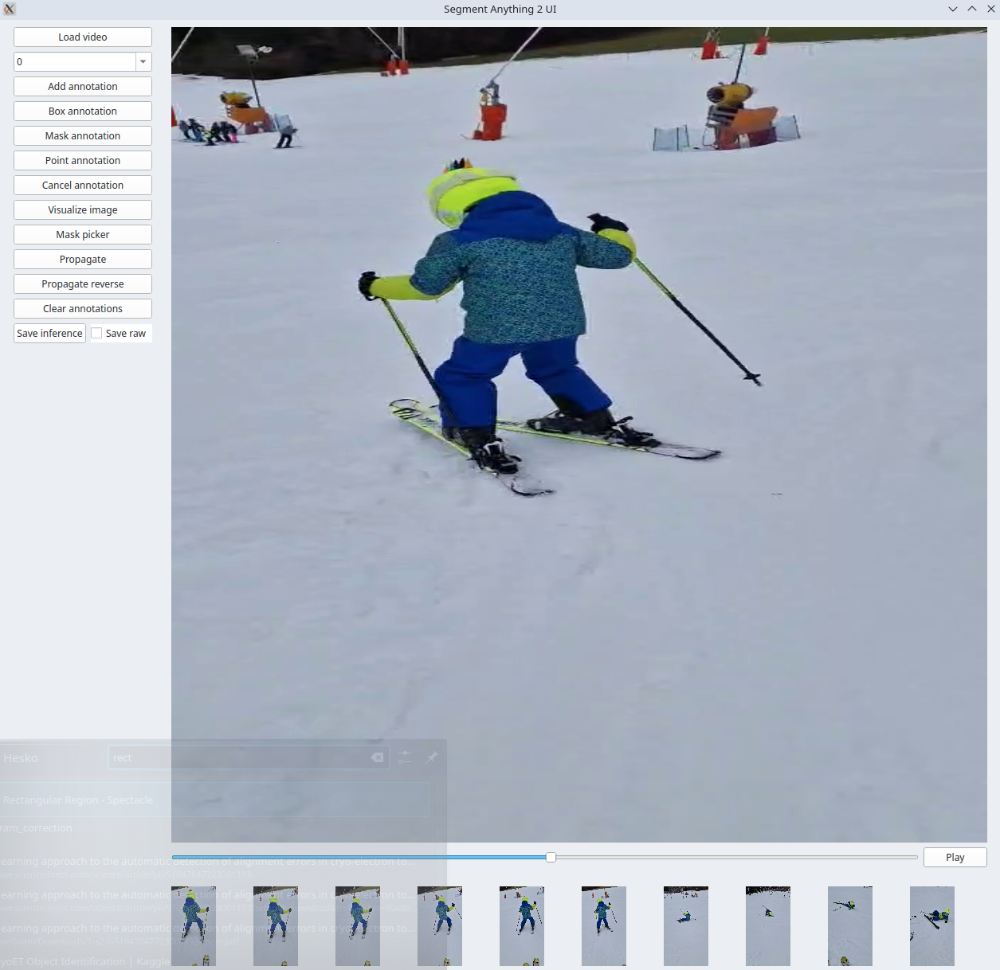

# Segment Anything 2 UI

Segment Anything 2 UI is a graphical user interface for video annotation, built using PySide6. It is inspired by Meta's demo web page and allows users to annotate videos with various tools such as bounding boxes, masks, and points.

This UI wraps the [Segment Anything 2](https://github.com/facebookresearch/sam2) model.

Please use this repository for image only annotation.
[Segment anything UI](https://github.com/branislavhesko/segment-anything-ui)





Example video:

<video width="320" height="240" controls>
   <source src="segment_anything_2_ui/assets/example.mp4" type="video/mp4">
   Your browser does not support the video tag.
</video>


## Features

- **Video Playback**: Play, pause, and navigate through video frames.
- **Annotation Tools**: Annotate videos using bounding boxes, masks, and points.
- **Visualization Modes**: Toggle between different visualization modes, including image and image with mask.
- **Thumbnail Previews**: Generate and display thumbnail previews for quick navigation.
- **Configurable Settings**: Customize settings through a dedicated settings widget.
- **Save inference data**: Save the inference data to a file using safetensors.
- **Multi-object tracking**: Track multiple objects in the video.

## Installation

1. **Clone the repository**:
   ```bash
   git clone https://github.com/yourusername/segment-anything-2-ui.git
   cd segment-anything-2-ui
   ```

2. **Install dependencies**:
   Make sure you have Python 3.10+ installed. Then, install the required packages:
   ```bash
   pip install -r requirements.txt
   ```

3. **Install SAM2**:
   SAM 2 needs to be installed first before use. The code requires `python>=3.10`, as well as `torch>=2.5.1` and `torchvision>=0.20.1`. Please follow the instructions [here](https://pytorch.org/get-started/locally/) to install both PyTorch and TorchVision dependencies. You can install SAM 2 on a GPU machine using:

   ```bash
   git clone https://github.com/facebookresearch/sam2.git && cd sam2

   pip install -e .
   ```
   If you are installing on Windows, it's strongly recommended to use [Windows Subsystem for Linux (WSL)](https://learn.microsoft.com/en-us/windows/wsl/install) with Ubuntu.

4. **Download the SAM2 model checkpoint**:
   - [sam2.1_hiera_tiny.pt](https://dl.fbaipublicfiles.com/segment_anything_2/092824/sam2.1_hiera_tiny.pt)
   - [sam2.1_hiera_small.pt](https://dl.fbaipublicfiles.com/segment_anything_2/092824/sam2.1_hiera_small.pt)
   - [sam2.1_hiera_base_plus.pt](https://dl.fbaipublicfiles.com/segment_anything_2/092824/sam2.1_hiera_base_plus.pt)
   - [sam2.1_hiera_large.pt](https://dl.fbaipublicfiles.com/segment_anything_2/092824/sam2.1_hiera_large.pt)

Use curl or wget to download the model checkpoint and place it in the `checkpoints` directory.

5. ** Setup config.py file**:
   - Modify accordingly **segment_anything_2_ui/configs/config.py** file.


## Usage

1. **Run the application**:
   ```bash
   export PYTHONPATH=$PYTHONPATH:.
   python segment_anything_2_ui/ui/sam2_main_window.py
   ```

   ```powershell
   set PYTHONPATH=$PYTHONPATH;.
   python segment_anything_2_ui/ui/sam2_main_window.py
   ```

2. **Load a video**:
   - Click on the "Load video" button in the settings widget to select a video file.

3. **Annotate the video**:
   - Use the annotation tools provided in the settings widget to annotate the video frames.

4. **Propagate the inference data**:
   - Use the "Propagate" button to propagate the inference data to the next frames.
   - Use the "Propagate reverse" button to propagate the inference data to the previous frames.

5. **Save the inference data**:
   - Use the "Save" button to save the inference data to a file using safetensors.

## Contributing

Contributions are welcome!
## License

This project is licensed under the MIT License. See the [LICENSE](LICENSE) file for more details.

## Acknowledgments

- Inspired by Meta's demo web page.
- Built with PySide6 for a seamless user interface experience.
- [Segment Anything 2](https://github.com/facebookresearch/sam2) model.
- Used for annotation of videos or images.